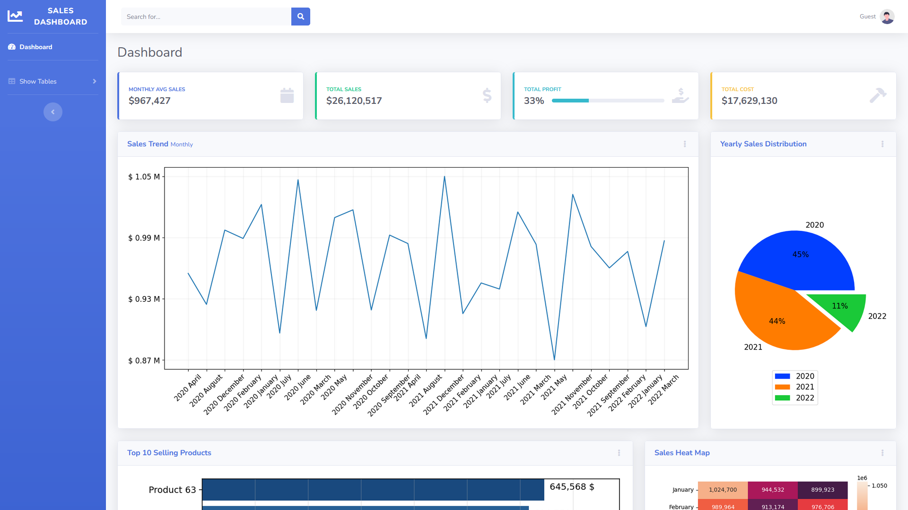

# Sales Dashboard



## Overview
This project is a web-based sales dashboard built using Flask. The dashboard connects to a MySQL database, retrieves sales data, and presents it through various visualizations and metrics using `seaborn` and `matplotlib`. Additionally, a separate module is available for importing data from Excel files into the MySQL database.

## Features
- **Data Visualization**: Insightful visualizations of sales data using `seaborn` and `matplotlib`.
- **Data Export**: A module to export data from Excel files into the MySQL database.
- **Web Interface**: A Flask-based web interface to display visualizations and relevant metrics and to download them to your client if needed.
- **Mobile Responsiveness**: Ensures compatibility with several mobile devices.

## Future Enhancements
- **Filters for Visualizations**: Add filters for all visualizations to allow users to view data based on different criteria such as date ranges, products, regions, etc.
- **Display Raw Data** [WIP]: Add a feature to display raw tables directly from the database in the dashboard.
  
## Installation

### Prerequisites
- Python 3.x
- MySQL Database
  
### Dependencies
Install required dependencies using `pip`:

```bash
pip install -r requirements.txt
```

### MySQL Database Requirement
Ensure you have a MySQL database set up with appropriate sales data. Use the provided database import module to upload data from an Excel file to the database.

### Data Import Module
To populate the database with data, use the separate module as follows:

```bash
python database_import.py
```

This script will read the Excel file in the `/data` folder and create the tables for the MySQL database.


### Configuration
Update the database configuration in the `.env` or config file at the root folder:

```bash
DATABASE_NAME=<your_database_name>
HOST=<your_mysql_host>
USERNAME=<your_mysql_user>
PASSWORD=<your_mysql_password>
```

## Running the Application

1. Ensure your MySQL database is up and running.
2. Run the Flask application:

```bash
python app.py
```

3. Access the dashboard by navigating to `http://localhost:5000` in your web browser.


## Future Features and Improvements
- **Data Filtering**: Add advanced filters for visualizations, allowing users to filter by different parameters such as time, product category, region, or sales representative.
- **Raw Table Display**: Display raw database tables on the dashboard for easy access to detailed data.
- **Data Export from Dashboard**: Add functionality to export the visualized data and raw tables back to an Excel or CSV file.
- **User Authentication**: Introduce user authentication to secure access to the dashboard, restricting certain users from accessing sensitive sales data.
- **Real-time Data Updates**: Implement WebSockets or periodic AJAX requests to fetch real-time data for the dashboard.
- **Mobile Responsiveness**: Improve the design to ensure compatibility with mobile devices.


## License
This project is licensed under the MIT License.

---
